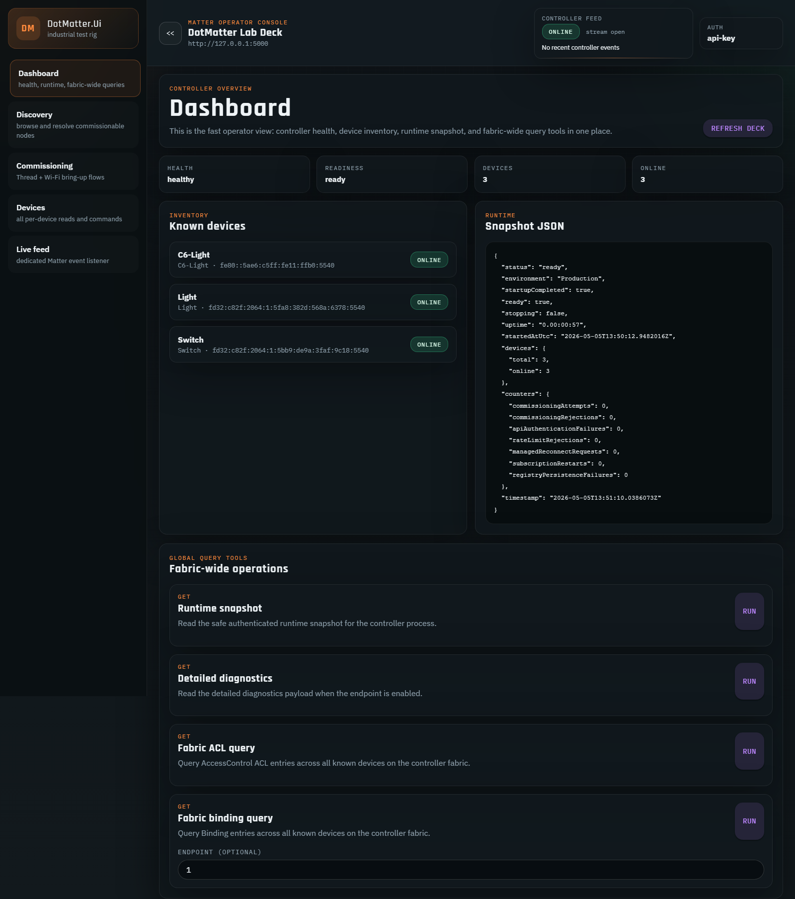
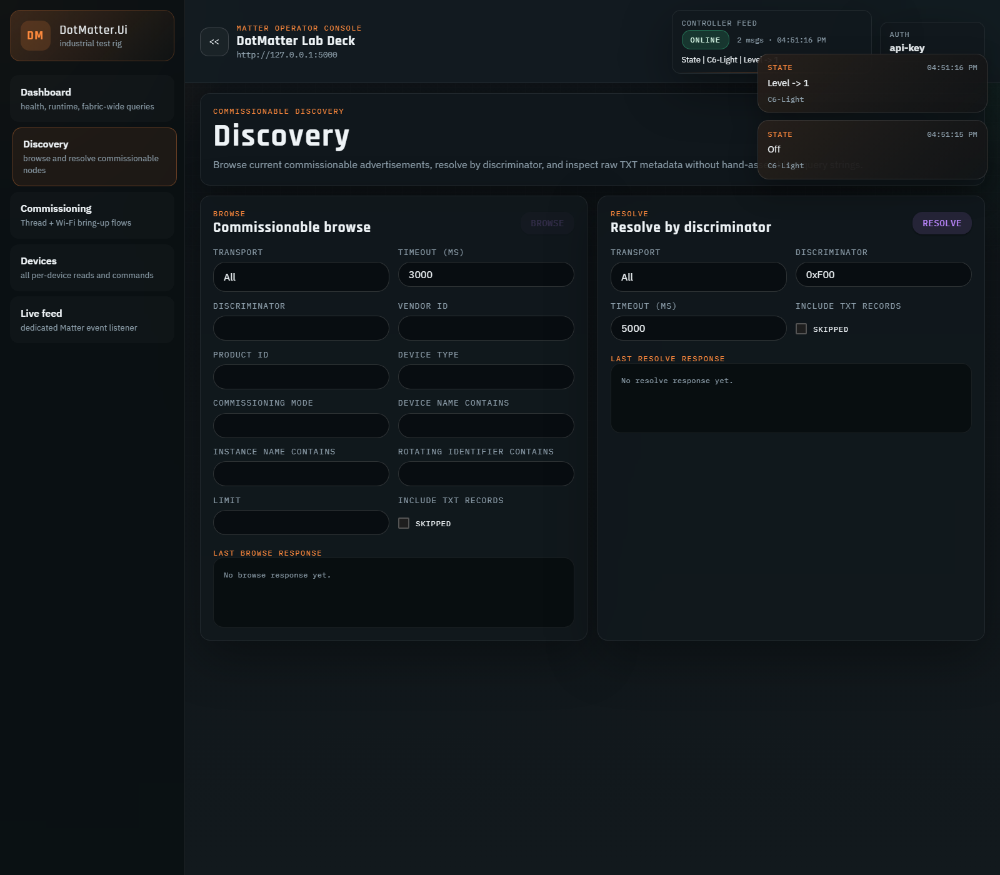
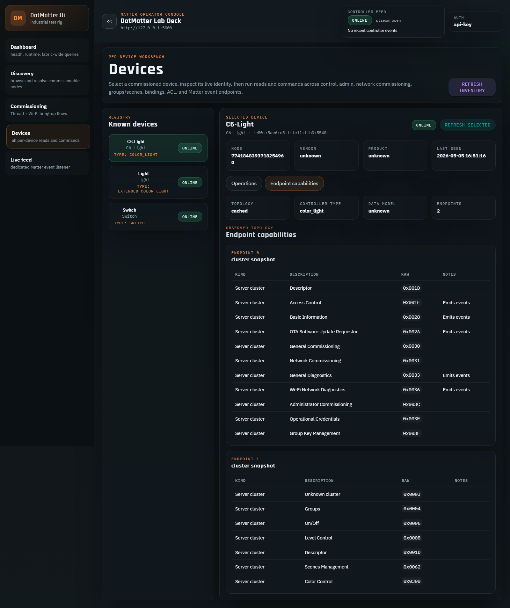
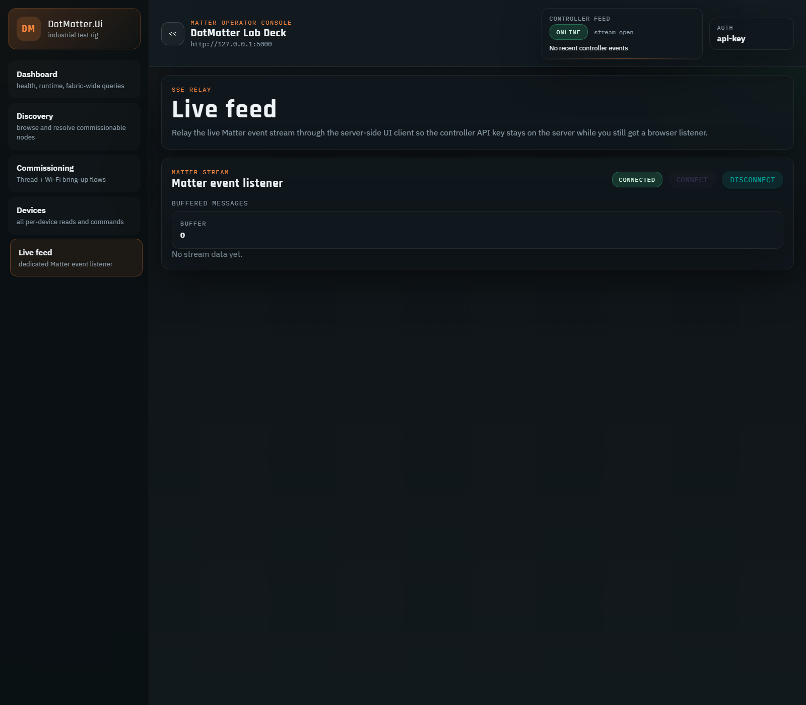

# DotMatter.Ui

`DotMatter.Ui` is the operator-facing companion to `DotMatter.Controller`: a server-hosted Blazor Web App that keeps the controller API key on the server while exposing a faster workflow for commissioning, discovery, device control, and live event inspection.

## What it covers

- Dashboard view for controller health, readiness, runtime snapshot, and fabric-wide operations
- Commissionable-device discovery with browse and resolve flows
- Commissioning workflows for Thread and Wi-Fi bring-up
- Capability-aware per-device workbench driven by `/api/devices/{id}/capabilities`
- Split live feeds:
  - layout/topbar relay for controller events via `/api/events`
  - dedicated Matter event page for `/api/matter/events`

## Routes

| Route | Page | Purpose |
| --- | --- | --- |
| `/` | Dashboard | Controller health, runtime snapshot, inventory, and fabric-wide operations |
| `/discovery` | Discovery | Browse and resolve commissionable advertisements |
| `/commissioning` | Commissioning | Send Thread / Wi-Fi commissioning requests |
| `/devices` | Devices | Inspect one device, view endpoint capabilities, and run scoped operations |
| `/live-feed` | Live feed | Keep a dedicated Matter event stream open without exposing the API key to the browser |

## Screenshots

These screenshots were captured from a Pi-backed deployment with the UI talking to a live `dot-matter` service.

### Dashboard



### Discovery



### Device workbench



### Live feed



## Local development

Run the controller and UI side-by-side:

```bash
dotnet run --project DotMatter.Controller
dotnet run --project DotMatter.Ui
```

By default the UI points at `http://localhost:5000`. Override the server-side controller client when needed:

```dotenv
ControllerApi__BaseUrl=http://192.168.1.127:5000
ControllerApi__ApiKey=replace-with-the-controller-api-key
ControllerApi__RequestTimeoutSeconds=45
ControllerApi__StreamBufferLimit=160
```

Because the UI is server-hosted, `ControllerApi__ApiKey` stays on the UI server and is not exposed to the browser.

## Raspberry Pi deployment

- Service name: `dot-matter-ui`
- Default URL: `http://<pi>:5001`
- Runtime env file: `/etc/dotmatter/dot-matter-ui.env`
- Default controller base URL: `http://127.0.0.1:5000`

When controller auth is enabled, the UI also needs a valid `ControllerApi__ApiKey` so its server-side HTTP client can call the controller.

Deploy the UI with:

```powershell
dotnet msbuild DotMatter.Ui -t:ValidateDeploySettings
dotnet msbuild DotMatter.Ui -t:Deploy
```

See [Deployment Guide](DEPLOYMENT.md) for the Pi service layout and [Configuration Reference](CONFIGURATION.md) for all UI settings.
